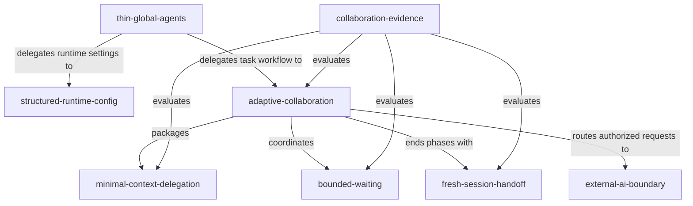

# Codex 配置与协作知识图 v0.1

- **状态：** current practice / publication review required
- **观察日期：** 2026-08-11
- **主题：** 精简个人全局配置、按任务选择协作、最小化子代理上下文、等待退避与长任务交接
- **权威边界：** 本文保存脱敏后的设计、关系和本地验证摘要；真实运行配置仍由使用者本机的 Codex 配置拥有，不从本文反向覆盖。

## 问题

个人 Codex 配置容易同时承载工程原则、项目流程、模型路由、子代理编排、等待策略和外部 Review，最终形成高密度、重复且容易过期的全局规则。

目标不是删除约束，而是让每类信息只由一个稳定边界拥有：

```text
长期行为原则       → Global AGENTS.md
模型、权限、并发   → config.toml 与 Agent 配置
专项协作流程       → Skill
项目事实和命令     → Project AGENTS.md
一次性要求         → 当前任务
外部模型协作       → 有独立授权边界的外部协作 Skill
效率证据           → 只读、单次聚合的本地统计
```

## 知识节点

| ID | 节点 | 类型 | 当前结论 | 证据状态 |
| --- | --- | --- | --- | --- |
| `thin-global-agents` | 精简 Global AGENTS | practice | 全局文件只保存长期工程原则、事实与验证、授权边界、基础 Review/Agent/沟通原则 | local configuration verified |
| `structured-runtime-config` | 结构化运行配置 | configuration boundary | 模型、推理、并发、权限与自动压缩属于结构化配置，不写进自然语言路由规范 | local configuration verified |
| `adaptive-collaboration` | 自适应协作 | skill | 简单任务直接执行；仅在独立可验收且有明确收益时协作 | skill structure and discovery verified |
| `minimal-context-delegation` | 最小上下文委派 | execution pattern | 委派默认不继承历史；必要时只继承最小正整数轮次 | local rollout sample verified; long-term effect unverified |
| `bounded-waiting` | 有界等待与退避 | execution pattern | 独立任务批量启动，只在结果必要时等待；无状态变化后不立即重复轮询 | rule installed; efficiency improvement unverified |
| `fresh-session-handoff` | 长任务换新会话 | execution pattern | 独立阶段之间使用精简 handoff，不自动创建新会话 | rule installed; long-term effect unverified |
| `external-ai-boundary` | 第三方模型边界 | authorization boundary | 只有用户请求或授权时才调用第三方模型，不静默选择、发送或切换 Provider | local Skill contract verified |
| `collaboration-evidence` | 协作效率证据 | evaluation | 一次扫描复用同一快照，分别观察上下文继承、等待、token 活动、耗时和 Review 结果 | collector behavior locally verified |

## 关系



## 已验证事实

截至观察日期，本地验证确认：

- Global AGENTS 已压缩为 45 行，没有模型名称、角色路由、Hook、并发、等待或长会话流程；
- UserPromptSubmit 路由 Hook 和旧强制委派脚本均不再生效；
- 自动压缩阈值为 `240000`，真实模型上下文窗口没有因此被缩小；
- 最大并发线程数为 4，Agent 角色继续由结构化配置维护；
- `adaptive-collaboration` Skill 通过结构校验，并能被新的 Codex prompt 发现；
- 本地统计脚本在一次 session 扫描中同时聚合 token、等待与真实 `spawn_agent` 参数；
- 2026-08-11 的一次本地短窗口回放包含 57 个去重 session 和 15 次真实 spawn；15 次均使用无历史继承，未出现全历史继承、字段省略、非法值或参数解析失败；
- 同一短窗口仍观察到 208 次等待调用，其中 100 次属于连续等待首轮之后的请求。

这些计数来自本地 rollout 活动日志，不是官方账户 usage、账单或扣费数据。

## 已验证实践

### 1. Global 只保存长期边界

保留：

- 简单、明确、可维护的实现原则；
- 事实、推断与未验证信息的区分；
- 变更范围和不可逆操作授权；
- 与风险匹配的验证；
- 高风险修改考虑独立 Review；
- Agent 只用于有明确收益、可独立验收的工作。

下沉：

- 项目目录、命令、架构和部署流程；
- 模型、角色、并发、沙箱与 Hook；
- 固定子代理路由；
- 等待、退避和长会话编排；
- 特定第三方 Review 工具。

### 2. 协作由任务收益触发

协作前要求工作包具备：

- 独立目标；
- 明确范围；
- 可单独判断的验收条件；
- 可解释的时间或质量收益。

简单、机械、紧耦合或已充分限定的任务直接执行，不为了流程形式增加 Agent。

### 3. 委派只传任务局部上下文

最小任务包包含：

- 目标；
- 精确范围和路径；
- 已知限制；
- 预期输出；
- 验收标准。

默认不继承主任务历史。只有无法安全摘要、且最近对话确实影响完成结果时，才继承完成工作所需的最少轮次。

### 4. 等待与长任务是流程，不是全局原则

独立工作先批量启动，主线程继续处理可并行事项；结果真正成为依赖时才进行一次有界等待。等待没有状态变化时，继续其他工作、等待事件或延长下一次必要检查间隔。

主要阶段完成后，如果剩余目标已经独立，使用只包含结果、路径、变更、验证、剩余目标、风险和验收条件的 handoff 开启新会话。

## 推断与未验证项

- 精简 Global 减少了每个任务都要读取的自然语言规则，但尚未用等长、同类型任务证明总 token 或完成时间下降；
- 无历史委派减少了上下文重放，但不同任务类型的质量、首结果时间和返工次数仍需长期对照；
- 等待退避已写入 Skill，但短窗口仍存在大量重复等待，不能宣称优化结果已完成；
- 自动压缩阈值是成本和上下文管理 guardrail，不保证任务不会再次达到高上下文区间；
- 第三方模型的效果取决于明确授权、Provider 能力、任务类型和本地复核，不能由工具名称预先保证。

## 反模式

| 反模式 | 风险 | 修正 |
| --- | --- | --- |
| 每个非机械任务强制委派 | 简单任务增加时间、token 和协调成本 | 只在独立验收且有明确收益时协作 |
| Global 固定模型和角色 | 模型能力与产品机制变化后规则失效 | 放进结构化配置并由实际效果复核 |
| 默认继承完整对话 | 子代理重复接收无关历史 | 默认无历史，必要时最小有界继承 |
| 逐个 Agent 高频轮询 | 重复上下文和大量无状态等待 | 批量等待、事件驱动或逐步退避 |
| 一个超长会话覆盖所有阶段 | 每次等待和工具调用重放大型上下文 | 阶段结束后生成精简 handoff |
| 每次选择 Agent 前全量扫描历史 | 为节省 token 反而重复读取大量日志 | 周期性生成一次可复用快照 |
| 把本地 rollout token 当账单 | 错误判断真实费用 | 仅作为本地活动和相对趋势证据 |

## 后续评估

后续应按等长窗口和相同任务类型比较：

- 简单任务的 Agent 使用率；
- 上下文继承模式；
- 首个有用结果和最终完成时间；
- Review 终态、有效 finding 和返工轮次；
- 等待超时与连续等待次数；
- 本地 rollout token 活动。

只有在质量不下降且证据可比时，才调整模型、角色、并发或协作规则。

## 输出边界

- 本图可以作为后续公开知识图谱的候选输入；
- 对外发布前必须再次脱敏、核对实时配置并完成用户 Review；
- Blog 应消费经过发布门禁、记录 Handbook commit 和内容哈希的公开导出，不读取本机配置或未经筛选的研究材料；
- 当前尚未创建 Blog 导出 schema、同步脚本或展示页面，不把本图称为已发布知识图谱。
